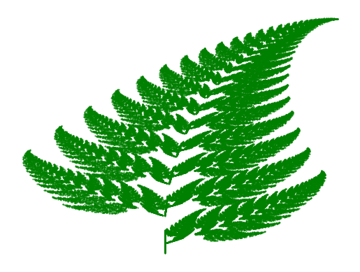
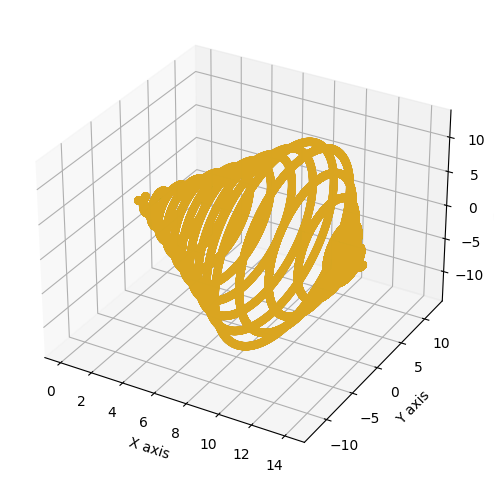
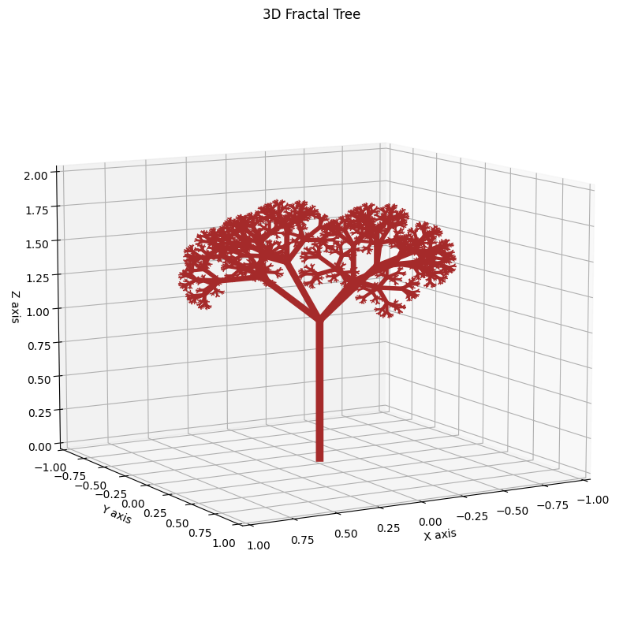

# generate-fractals
# Fractal Generation Project

## Overview
Fractals are mathematical structures characterized by repeating patterns that appear at every scale. In nature, fractals are seen in phenomena such as the branching of trees, the structure of fern leaves, and the formation of coastlines, where similar patterns recur at progressively smaller scales. Their pervasive presence in the natural world underscores the intrinsic connection between mathematics and the structure of the universe, revealing the underlying order in what might initially appear chaotic.

This project is dedicated to generating a fractals from nature such as a fern and tree. A seashell, while not a fractal can also be modelled by a mathematical formula. Each fractal is generated using specific mathematical formulas and visualized with Python's matplotlib library. The project is structured modularly, with separate scripts for each fractal pattern and a common utilities file for shared functionality.





## Getting Started

### Prerequisites
- Python 3.6 or higher
- matplotlib
- numpy

### Installation
1. Clone the repository to your local machine:
   ```
   git clone https://github.com/yourusername/fractal-generation.git
   ```
2. Install the required Python packages:
   ```
   pip install matplotlib numpy
   ```

### Running the Project
To generate a specific fractal, run the `main.py` script with Python:
```
python main.py
```

By default, `main.py` is set up to generate all included fractal patterns. You can modify this script to generate specific fractals or to change parameters such as the number of points or the recursion depth.

## Project Structure
- `main.py`: The entry point of the project, responsible for invoking the generation of different fractals.
- `utils.py`: Contains common utilities and shared functions used across multiple fractal scripts.
- `fractal_fern.py`: Defines the function to generate and plot the Barnsley Fern fractal.
- `seashell.py`: Implements the generation and visualization of the 3D Double Seashell fractal.
- `fractal_tree.py`: Provides the functionality to generate and visualize a 3D Fractal Tree.

## Unit Testing
Unit tests are an integral part of this project to ensure the reliability and correctness of fractal generation algorithms.

### Running Tests
To run the unit tests, navigate to the project's root directory and use the following command:

```
python -m unittest
```
This command discovers and runs all tests written in files matching the pattern `test*.py` within the project.

### Writing Tests
New unit tests can be added to the `tests/ directory`. Ensure each test file is named using the `test_*.py` pattern and contains test cases that inherit from `unittest.TestCase`.

## Contributing
We welcome contributions to this project! Whether you have suggestions for new fractal patterns to include, improvements to existing algorithms, or bug fixes, please feel free to make a pull request or open an issue.

## License

## License

This project is licensed under the GNU General Public License (GPL) v3.0. The GPL is a free, copyleft license that allows software to be freely used, modified, and shared under the same terms. GPL v3.0 further strengthens this approach by ensuring that all derived works are also distributed under the GPL, protecting the software's freedom and the rights of users of GPL-licensed code.

For more details, see the full GPL license text here: [GPL v3.0 License](https://www.gnu.org/licenses/gpl-3.0.html).


---
